# Git Worktree Manager & Subagent Orchestration Architecture

## Mermaid Architecture Diagram

```mermaid
graph TB
    subgraph "Client Layer"
        CLI[CLI Interface]
        API[API Gateway]
    end

    subgraph "Orchestration Layer"
        ORCH[Subagent Orchestrator]
        ROUTER[Request Router]
        QUEUE[Task Queue Manager]
        SCHED[Scheduler]
    end

    subgraph "Routing Strategies"
        RR[Round Robin]
        LL[Least Loaded]
        CB[Capability Based]
        PW[Priority Weighted]
    end

    subgraph "Subagent Pool"
        SA1[Code Gen Agent]
        SA2[Analysis Agent]
        SA3[Testing Agent]
        SA4[Refactor Agent]
        SA5[Debug Agent]
        SAn[... More Agents]
    end

    subgraph "Git Worktree Manager"
        WTM[Worktree Manager]
        WTC[Worktree Creator]
        WTL[Worktree Lister]
        WTR[Worktree Remover]
        WTP[Worktree Pruner]
    end

    subgraph "Git Operations"
        GWT[git worktree add]
        GCH[git checkout -b]
        GRM[git worktree remove]
        GPR[git worktree prune]
        GLS[git worktree list]
    end

    subgraph "Execution Environment"
        WT1[Worktree 1<br/>Branch: task-123]
        WT2[Worktree 2<br/>Branch: task-456]
        WT3[Worktree 3<br/>Branch: task-789]
        MAIN[Main Repo]
    end

    subgraph "Result Collection"
        RES[Result Aggregator]
        METRIC[Metrics Collector]
        LOG[Log Manager]
    end

    CLI --> ORCH
    API --> ORCH
    
    ORCH --> ROUTER
    ORCH --> QUEUE
    ORCH --> SCHED
    ORCH --> WTM
    
    ROUTER --> RR
    ROUTER --> LL
    ROUTER --> CB
    ROUTER --> PW
    
    SCHED --> SA1
    SCHED --> SA2
    SCHED --> SA3
    SCHED --> SA4
    SCHED --> SA5
    SCHED --> SAn
    
    SA1 -.->|executes in| WT1
    SA2 -.->|executes in| WT2
    SA3 -.->|executes in| WT3
    SA4 -.->|or shares| MAIN
    
    WTM --> WTC
    WTM --> WTL
    WTM --> WTR
    WTM --> WTP
    
    WTC --> GWT
    WTC --> GCH
    WTL --> GLS
    WTR --> GRM
    WTP --> GPR
    
    GWT --> WT1
    GWT --> WT2
    GWT --> WT3
    
    SA1 --> RES
    SA2 --> RES
    SA3 --> RES
    SA4 --> RES
    SA5 --> RES
    SAn --> RES
    
    RES --> METRIC
    RES --> LOG
    
    METRIC --> ORCH
    LOG --> ORCH

    style ORCH fill:#4A90E2,stroke:#2E5C8A,stroke-width:3px,color:#fff
    style WTM fill:#50C878,stroke:#2E7D4E,stroke-width:3px,color:#fff
    style ROUTER fill:#F39C12,stroke:#C87F0A,stroke-width:2px
    style RES fill:#9B59B6,stroke:#6C3483,stroke-width:2px,color:#fff
```



## ASCII Architecture Diagram

```
┌─────────────────────────────────────────────────────────────────┐
│                        CLIENT LAYER                              │
│  ┌──────────────┐              ┌──────────────┐                 │
│  │ CLI Interface│              │  API Gateway │                 │
│  └──────┬───────┘              └──────┬───────┘                 │
└─────────┼──────────────────────────────┼──────────────────────────┘
          │                              │
          └──────────────┬───────────────┘
                         ▼
┌─────────────────────────────────────────────────────────────────┐
│                   SUBAGENT ORCHESTRATOR                          │
│  ┌────────────────────────────────────────────────────────┐    │
│  │  Request Router  │  Task Queue  │  Scheduler            │    │
│  └────────┬─────────┴──────┬───────┴────────┬─────────────┘    │
│           │                 │                 │                  │
│  ┌────────▼─────────────────▼─────────────────▼──────────┐     │
│  │  Routing Strategies:                                   │     │
│  │  • Round Robin      • Capability-Based                 │     │
│  │  • Least Loaded     • Priority Weighted                │     │
│  └────────────────────────────────────────────────────────┘     │
└─────────┬───────────────────────────────────┬────────────────────┘
          │                                   │
          │                                   │
┌─────────▼──────────────────┐   ┌────────────▼────────────────────┐
│   SUBAGENT POOL            │   │   GIT WORKTREE MANAGER          │
│  ┌──────────────────────┐  │   │  ┌──────────────────────────┐  │
│  │ ┌─────────────────┐  │  │   │  │ createWorktree()         │  │
│  │ │ Code Gen Agent  │  │  │   │  │ removeWorktree()         │  │
│  │ └─────────────────┘  │  │   │  │ listWorktrees()          │  │
│  │ ┌─────────────────┐  │  │   │  │ checkoutBranch()         │  │
│  │ │ Analysis Agent  │  │  │   │  │ pruneWorktrees()         │  │
│  │ └─────────────────┘  │  │   │  └──────────┬───────────────┘  │
│  │ ┌─────────────────┐  │  │   │             │                  │
│  │ │ Testing Agent   │  │  │   │  ┌──────────▼───────────────┐  │
│  │ └─────────────────┘  │  │   │  │ git worktree add -b      │  │
│  │ ┌─────────────────┐  │  │   │  │ git checkout -b          │  │
│  │ │ Refactor Agent  │  │  │   │  │ git worktree remove      │  │
│  │ └─────────────────┘  │  │   │  │ git worktree prune       │  │
│  │ ┌─────────────────┐  │  │   │  └──────────────────────────┘  │
│  │ │  Debug Agent    │  │  │   └─────────────────────────────────┘
│  │ └─────────────────┘  │  │                   │
│  └──────────┬───────────┘  │                   │
└─────────────┼──────────────┘                   │
              │                                  │
              │   ┌──────────────────────────────▼──────────────┐
              │   │    EXECUTION ENVIRONMENTS                   │
              │   │  ┌──────────┐  ┌──────────┐  ┌──────────┐  │
              │   │  │Worktree 1│  │Worktree 2│  │Worktree 3│  │
              └───┼─▶│task-123  │  │task-456  │  │task-789  │  │
                  │  │ (branch) │  │ (branch) │  │ (branch) │  │
                  │  └──────────┘  └──────────┘  └──────────┘  │
                  │  ┌──────────────────────────────────────┐  │
                  │  │      Main Repository (shared)        │  │
                  │  └──────────────────────────────────────┘  │
                  └─────────────────────────────────────────────┘
                                      │
                  ┌───────────────────┴───────────────────┐
                  ▼                                       ▼
┌─────────────────────────────────┐   ┌──────────────────────────┐
│    RESULT AGGREGATOR            │   │   METRICS & LOGGING      │
│  • Collect subagent results     │   │  • Performance metrics   │
│  • Merge modified files         │   │  • Resource usage        │
│  • Track execution status       │   │  • Success/failure rates │
│  • Handle errors                │   │  • Execution logs        │
└─────────────────────────────────┘   └──────────────────────────┘
```

## Component Interaction Flow

```
┌──────────┐
│  Client  │
└─────┬────┘
      │ 1. Submit AgentRequest
      ▼
┌─────────────────┐
│  Orchestrator   │
└─────┬───────────┘
      │ 2. Route to capability
      ▼
┌─────────────────┐
│  Request Router │◄──── Routing Strategies
└─────┬───────────┘
      │ 3. Select best subagent
      ▼
┌─────────────────┐
│   Scheduler     │
└─────┬───────────┘
      │ 4. Check if worktree needed
      ▼
┌─────────────────┐
│ Worktree Mgr    │
└─────┬───────────┘
      │ 5. Create isolated worktree
      │    git worktree add -b task-123 ./wt-123
      ▼
┌─────────────────┐
│   Subagent      │
└─────┬───────────┘
      │ 6. Execute task in worktree
      │    - Modify files
      │    - Run tests
      │    - Commit changes
      ▼
┌─────────────────┐
│ Result Collector│
└─────┬───────────┘
      │ 7. Aggregate results
      ▼
┌─────────────────┐
│ Worktree Mgr    │
└─────┬───────────┘
      │ 8. Cleanup worktree
      │    git worktree remove ./wt-123
      ▼
┌─────────────────┐
│  Orchestrator   │
└─────┬───────────┘
      │ 9. Return SubagentResult
      ▼
┌──────────┐
│  Client  │
└──────────┘
```

## Key Design Principles

### 1. Isolation Through Worktrees
- Each subagent can work in an isolated git worktree
- Prevents conflicts between concurrent tasks
- Enables parallel execution on different branches
- Clean separation of concerns

### 2. Capability-Based Routing
- Requests are routed based on required capabilities
- Multiple subagents can share capabilities (load balancing)
- Dynamic selection based on current load and priorities

### 3. Lifecycle Management
- Automatic worktree creation for isolated tasks
- Cleanup of worktrees after task completion
- Pruning of stale worktrees
- Resource limit enforcement

### 4. Flexibility
- Subagents can run in worktrees OR shared main repo
- Configurable isolation per subagent type
- Multiple routing strategies available
- Pluggable architecture for new capabilities
