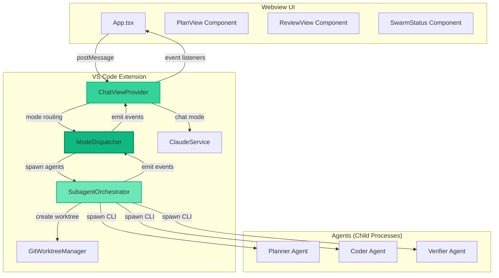
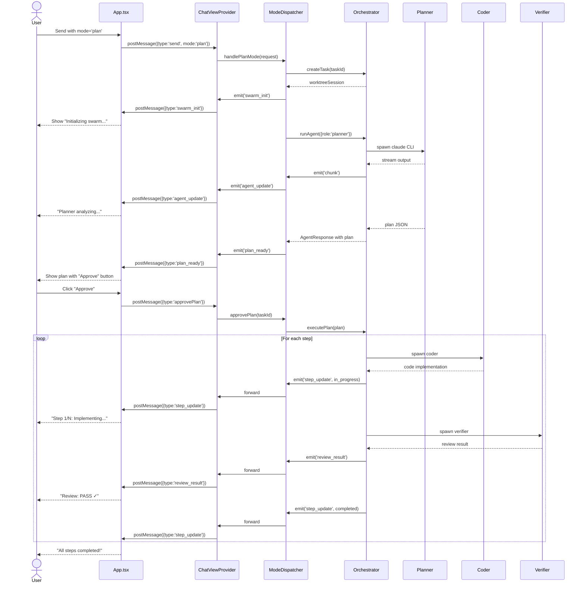
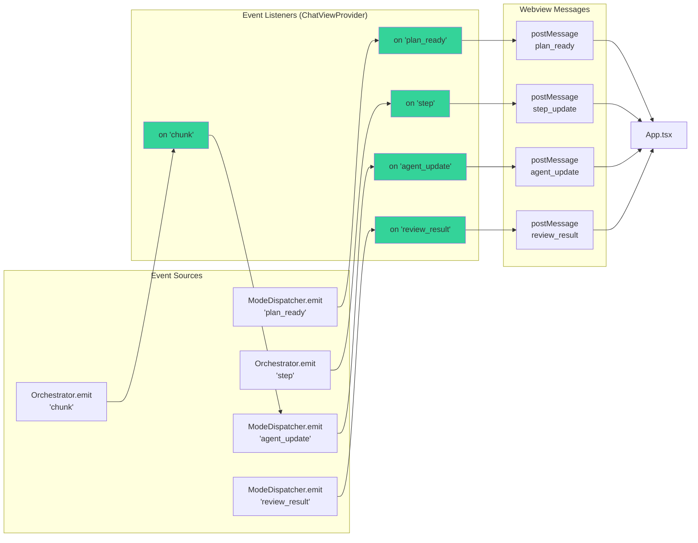
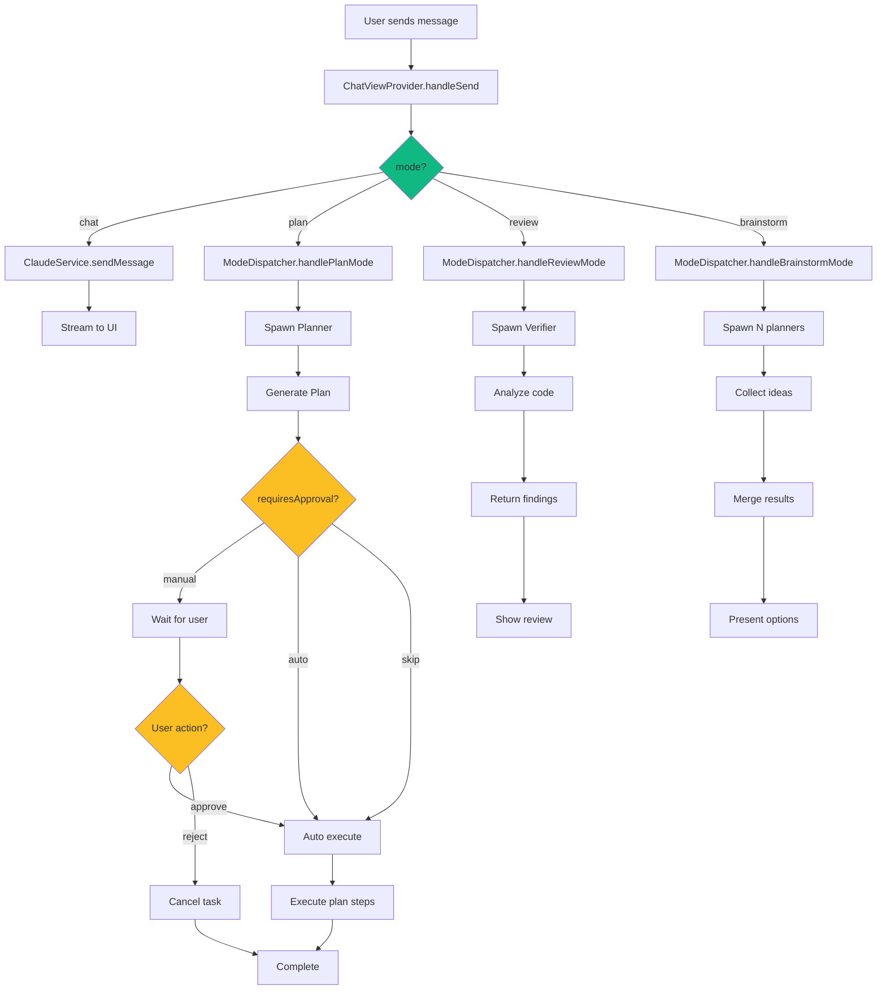
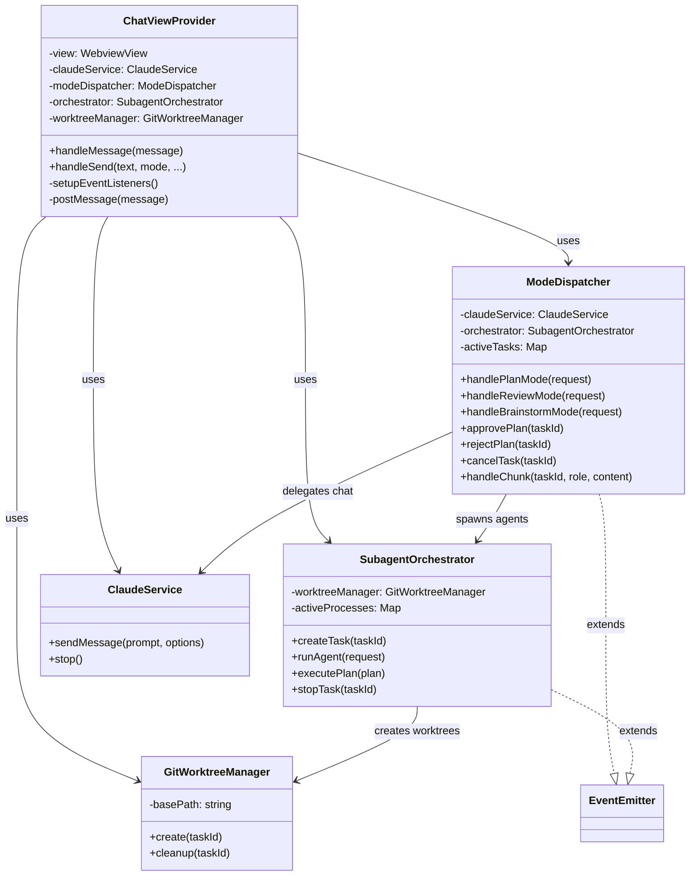
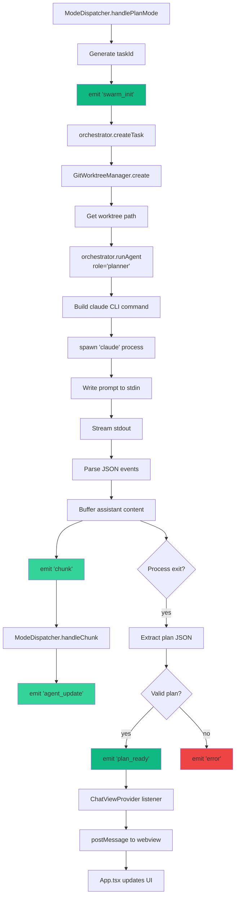
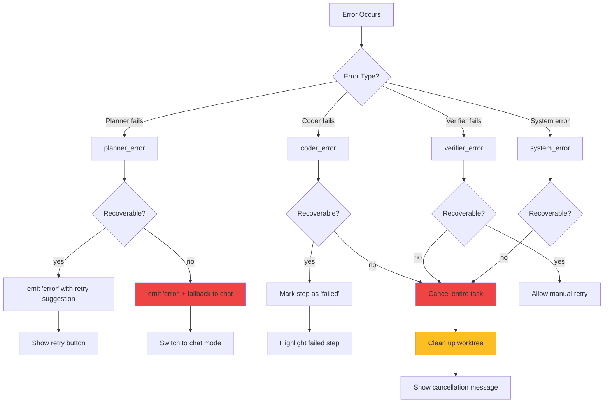
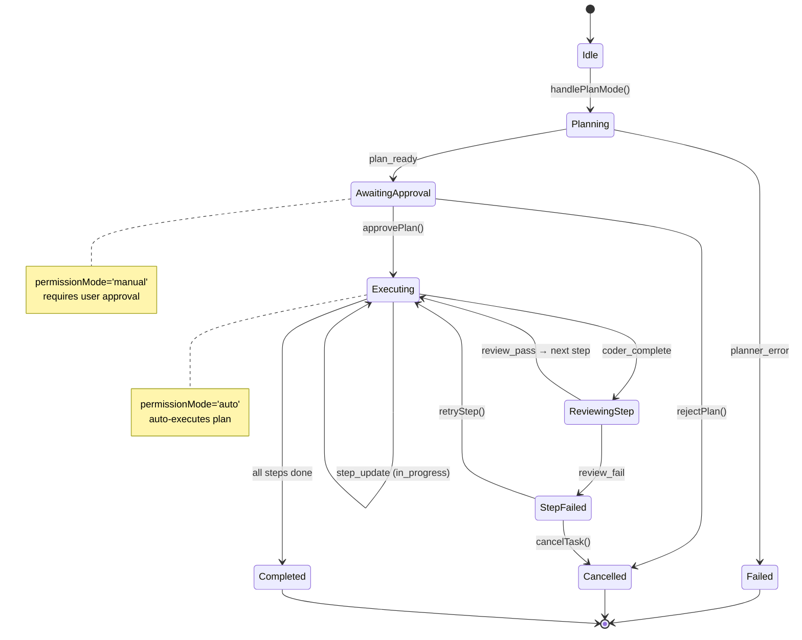
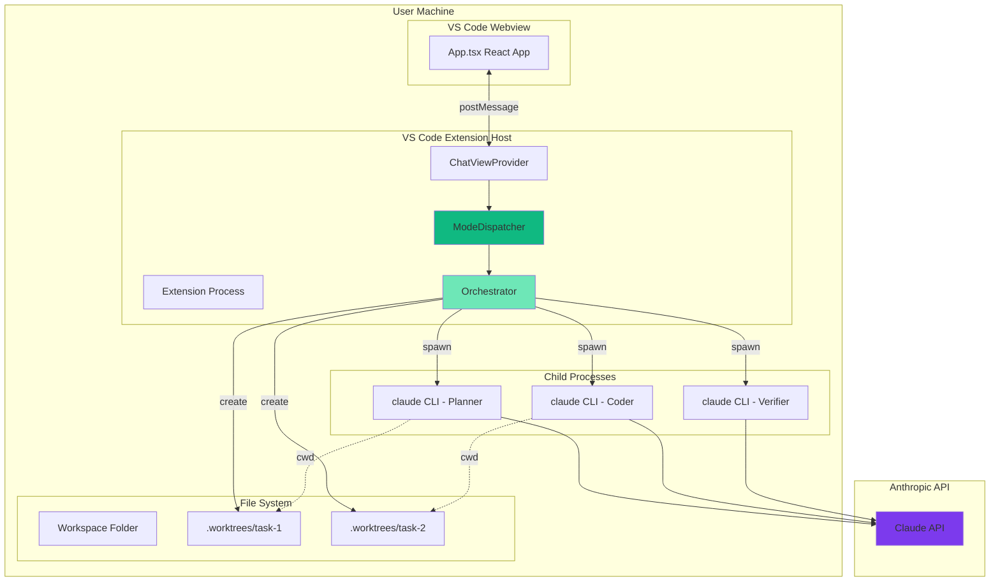

# AR2 Service Integration - Architecture Diagrams

## Component Architecture

## Message Flow - Plan Mode

## Event Flow

## Mode Routing Decision Tree

## Class Diagram

## Data Flow - Agent Spawning

## Error Handling Flow

## State Machine - Task Lifecycle

---

## Deployment Architecture

---

**Document Status:** Complete
**Created By:** AR2 - Service Integration Architect
**Date:** 2025-12-07
